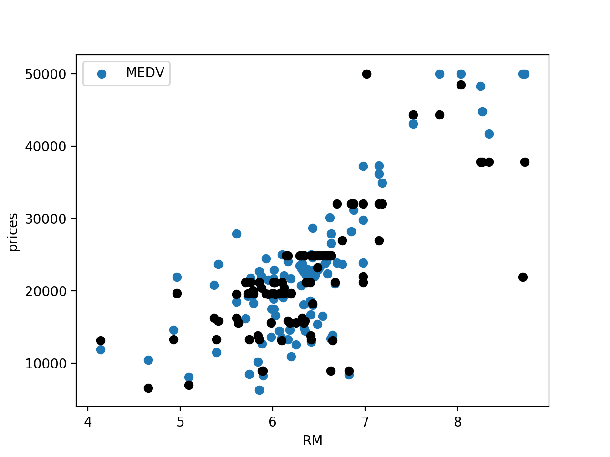
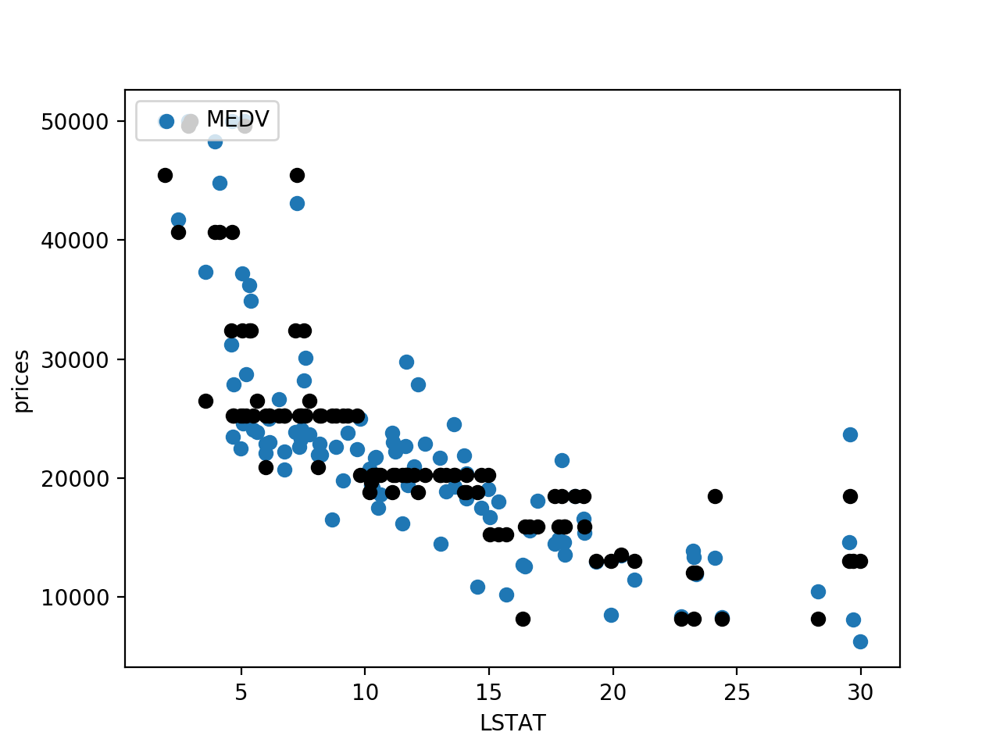

Boston house pricing using UCI housing dataset. https://archive.ics.uci.edu/ml/machine-learning-databases/housing/

Note: Here the decision tree is being used as a regressor. More details: http://scikit-learn.org/stable/auto_examples/tree/plot_tree_regression.html

Result:
Parameter max_depth or the optimal model: 5.00
R2_score for prediction: 0.86

Visualizations:

I)
 - X-axis: Number of rooms
 - y-axis: price
 

II)
 - X-axis: Number of rooms
 - y-axis: price

